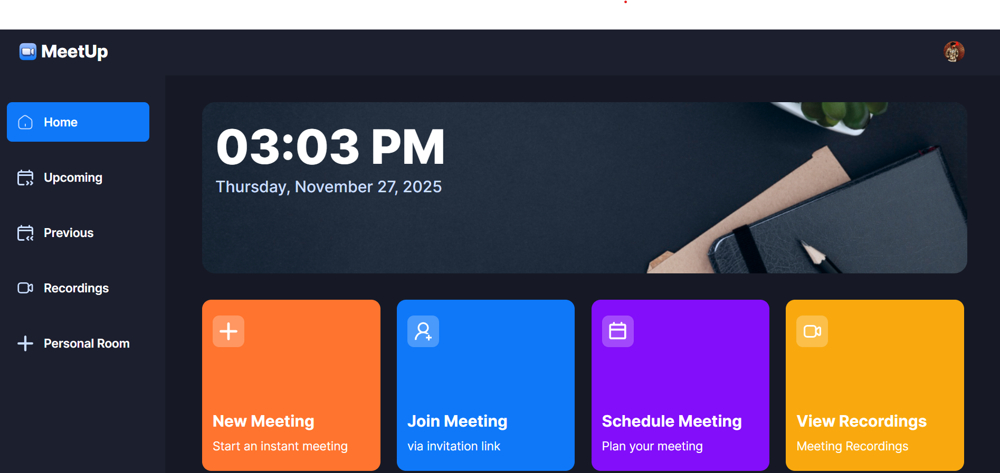
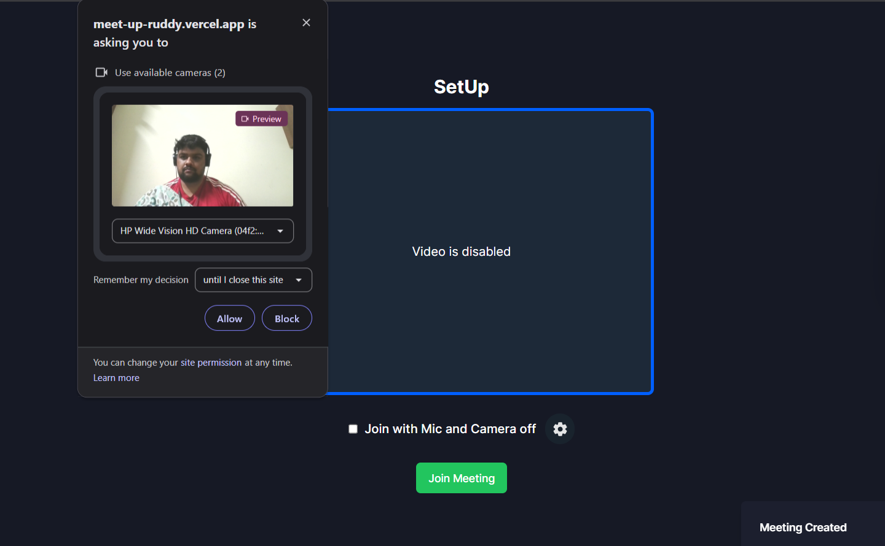
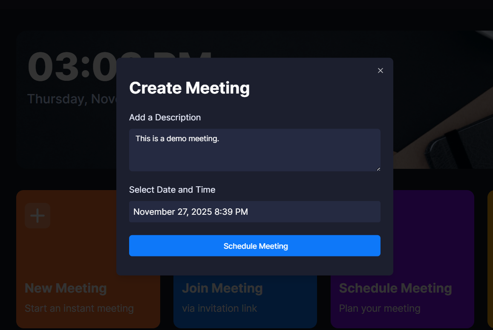
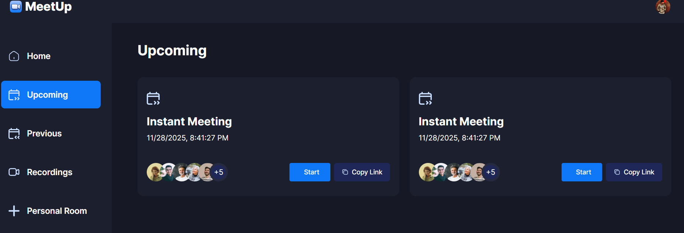
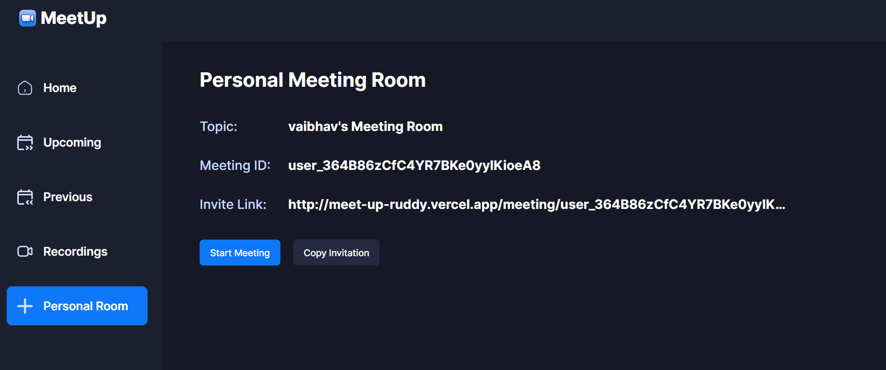

<div align="center">
  <br />

  <h1 align="center">MeetUp</h1>
  <h4>A modern video conferencing application - Your own variation of Zoom</h4>
</div>

## 📋 Table of Contents

- [Tech Stack](#tech-stack)
- [Features](#features)
- [Setup Instructions](#setup-instructions)
- [Project Structure](#project-structure)
- [Environment Variables](#environment-variables)
- [Usage](#usage)
- [Assumptions & Bonus Features](#assumptions--bonus-features)

## <a name="tech-stack">⚙️ Tech Stack</a>

### Frontend
- **Next.js 14.2.0** - React framework with App Router
- **TypeScript** - Type-safe development
- **Tailwind CSS 3.3.0** - Utility-first CSS framework
- **shadcn/ui** - High-quality React components
- **Lucide React** - Beautiful icon library

### Backend & Real-time
- **Stream.io Video SDK** - Real-time video calling and conferencing
- **Clerk** - Authentication and user management
- **Node.js SDK (Stream)** - Server-side token generation

### Additional Libraries
- **React DatePicker** - Date/time selection
- **Radix UI** - Unstyled, accessible component primitives
- **Class Variance Authority** - Component styling patterns
- **PostCSS & Autoprefixer** - CSS processing

## <a name="features">🔋 Features</a>

### Authentication & Authorization
👉 **Secure Authentication**: Implements Clerk for secure login via social sign-on (Google, GitHub, etc.) or email/password methods with role-based access control.

### Meeting Management
👉 **New Meeting**: Quickly start instant meetings with camera and microphone configuration.

👉 **Schedule Future Meetings**: Schedule meetings with specific date/time for future reference.

👉 **Personal Room**: Unique persistent meeting link for each user, shareable for instant access.

👉 **Join via Link**: Easy meeting joining using invitation links.

### Meeting Controls
👉 **Full Meeting Controls**: Recording, emoji reactions, screen sharing, muting/unmuting, volume control, and layout switching.

👉 **Layout Options**: Grid layout, speaker-left, and speaker-right views.

👉 **Participant Management**: View participants, pin/unpin speakers, manage audio/video for individual participants.

### Meeting History & Recordings
👉 **Upcoming Meetings**: View and manage scheduled meetings.

👉 **Previous Meetings**: Access history of completed calls.

👉 **Recordings**: View and access recordings of past meetings.

### User Experience
👉 **Responsive Design**: Seamless experience across desktop, tablet, and mobile devices.

👉 **Real-time Updates**: Live participant status, call state management.

👉 **Toast Notifications**: User-friendly feedback for actions (copy link, meeting created, etc.).

👉 **Loading States**: Smooth Loader component for async operations.

## <a name="setup-instructions">🚀 Setup Instructions</a>

### Prerequisites
- Node.js 18+ and npm/yarn
- Clerk account (https://clerk.com)
- Stream.io account (https://getstream.io)

### Installation Steps

1. **Clone the repository**
   ```bash
   git clone <repository-url>
   cd meetup
   ```

2. **Install dependencies**
   ```bash
   npm install
   # or
   yarn install
   ```

3. **Set up environment variables**
   ```bash
   cp .env.example .env.local
   ```
   See [Environment Variables](#environment-variables) section below.

4. **Run the development server**
   ```bash
   npm run dev
   # or
   yarn dev
   ```

5. **Open in browser**
   Navigate to `http://localhost:3000`

### Build for Production
```bash
npm run build
npm start
```

### Linting
```bash
npm run lint
```

## <a name="environment-variables">🔐 Environment Variables</a>

Create a `.env.local` file in the root directory:

```env
# Clerk Authentication
NEXT_PUBLIC_CLERK_PUBLISHABLE_KEY=your_clerk_publishable_key
CLERK_SECRET_KEY=your_clerk_secret_key

# Stream.io Configuration
NEXT_PUBLIC_STREAM_API_KEY=your_stream_api_key
STREAM_SECRET_KEY=your_stream_secret_key

# Application
NEXT_PUBLIC_BASE_URL=http://localhost:3000
```

### Getting API Keys

**Clerk Setup:**
1. Sign up at https://clerk.com
2. Create a new application
3. Copy your Publishable Key and Secret Key from Dashboard → API Keys

**Stream.io Setup:**
1. Sign up at https://getstream.io
2. Create a new app in your Dashboard
3. Copy your API Key from App Settings
4. Generate and copy your Secret from App Settings

## <a name="project-structure">📁 Project Structure</a>

```
.
├── app/
│   ├── (auth)/                 # Authentication pages
│   │   ├── sign-in/
│   │   └── sign-up/
│   ├── (root)/                 # Protected routes
│   │   ├── (home)/             # Main app layout
│   │   │   ├── page.tsx        # Home/Dashboard
│   │   │   ├── upcoming/       # Upcoming meetings
│   │   │   ├── previous/       # Previous meetings
│   │   │   ├── recordings/     # Call recordings
│   │   │   └── personal-room/  # Personal meeting room
│   │   └── meeting/
│   │       └── [id]/           # Dynamic meeting page
│   ├── layout.tsx              # Root layout
│   └── globals.css             # Global styles
├── components/
│   ├── ui/                     # shadcn/ui components
│   ├── Navbar.tsx              # Top navigation
│   ├── Sidebar.tsx             # Side navigation
│   ├── MobileNav.tsx           # Mobile navigation
│   ├── MeetingTypeList.tsx     # Meeting option cards
│   ├── MeetingModal.tsx        # Meeting dialogs
│   ├── MeetingRoom.tsx         # Active call interface
│   ├── MeetingSetup.tsx        # Pre-call setup
│   ├── CallList.tsx            # Meeting list display
│   ├── MeetingCard.tsx         # Individual meeting card
│   └── ...
├── hooks/
│   ├── useGetCalls.ts          # Fetch user's calls
│   └── useGetCallById.ts       # Fetch specific call
├── actions/
│   └── stream.actions.ts       # Server-side Stream actions
├── providers/
│   └── StreamClientProvider.tsx # Stream video client setup
├── constants/
│   └── index.ts                # Constants and config
├── lib/
│   └── utils.ts                # Utility functions
├── public/
│   ├── icons/                  # SVG icons
│   └── images/                 # Image assets
├── middleware.ts               # Clerk auth middleware
├── next.config.mjs             # Next.js config
├── tailwind.config.ts          # Tailwind configuration
├── tsconfig.json               # TypeScript config
└── package.json                # Dependencies
```

## <a name="usage">📖 Usage</a>

### Starting a Meeting

1. Go to Home page
2. Click "New Meeting" for instant meeting
3. Configure camera/microphone in setup screen
4. Click "Join Meeting"

### Scheduling a Meeting

1. Click "Schedule Meeting" on home
2. Enter description and select date/time
3. Copy the generated meeting link to share
4. Start the meeting when ready

### Joining a Meeting

1. Click "Join Meeting" on home
2. Paste the meeting link
3. Click "Join Meeting" button

### Viewing Recordings

1. Navigate to "Recordings" from sidebar
2. Click "Play" on any recording to view

## <a name="assumptions--bonus-features">💡 Assumptions & Bonus Features</a>

### Assumptions Made

1. **Authentication Flow**: Assumed Clerk handles all authentication, authorization is managed server-side via `currentUser()`.

2. **Stream.io Token Generation**: Tokens are generated server-side for security and have a 1-hour expiration with 60-second offset.

3. **Personal Room**: Each user has a persistent personal room using their user ID as the meeting ID.

4. **Real-time Queries**: Meeting queries filter by creation date and participants for accurate call listings.

5. **Recording Availability**: Recordings are fetched from Stream.io after calls complete (may have slight delay).

### Bonus Features Implemented

✨ **Toast Notifications System**: Custom toast implementation with auto-dismiss for user feedback.

✨ **Responsive Design**: Full mobile, tablet, and desktop support with adaptive layouts.

✨ **Dark Theme**: Complete dark mode UI with custom color palette (dark-1 through dark-4).

✨ **Multiple Layout Options**: Grid, speaker-left, and speaker-right layouts for meeting customization.

✨ **Copy Meeting Links**: One-click copy functionality for meeting invitations.

✨ **Participant Management**: Visual participant list with avatar display and count indicators.

✨ **Meeting Metadata**: Support for custom descriptions and scheduling information.

✨ **Smooth Animations**: CSS animations for modals, navigation drawer, and transitions.

## 🎨 Key Design Patterns

- **Server Components**: Used for layout and data fetching
- **Client Components**: Used for interactivity and real-time features
- **Custom Hooks**: Centralized data fetching logic (`useGetCalls`, `useGetCallById`)
- **Provider Pattern**: `StreamClientProvider` for video SDK initialization
- **Composition**: Component composition for reusable UI patterns

## 🔒 Security Considerations

- Clerk handles authentication with secure OAuth flows
- Server-side token generation via `stream.actions.ts`
- Middleware enforces authentication on protected routes
- Environment variables keep sensitive keys secure

## 📱 Browser Support

- Chrome (latest)
- Firefox (latest)
- Safari (latest)
- Edge (latest)


## 📸 Screenshots

### Home Page / Dashboard


### Meeting Room


### Schedule Meeting


### Upcoming Meetings


### Personal Room


